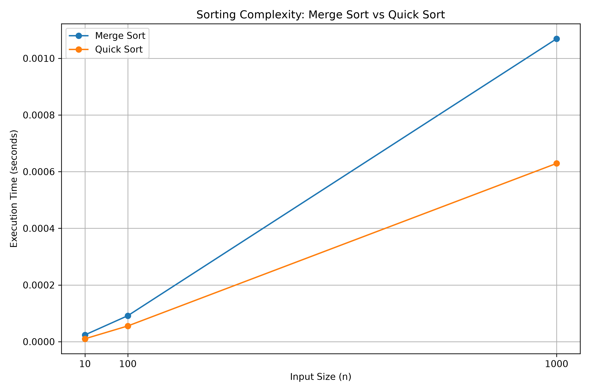

# Sorting Complexity Visualizer

## Description

This project visualizes and compares the growth of Merge Sort
and Quick Sort for different input sizes.

The input sizes considered are:

- n = 10
- n = 100
- n = 1000

A line chart is used to visualize the growth of the sorting
algorithms.

## Algorithm

### Merge Sort

1. Divide the array into two halves.
2. Recursively sort the two halves.
3. Merge the two sorted halves.
4. Continue until the complete array is sorted.

### Quick Sort

1. Select a pivot element.
2. Partition the array around the pivot.
3. Recursively sort the left part.
4. Recursively sort the right part.

## Time Complexity

### Merge Sort

Best Case: O(n log n)

Average Case: O(n log n)

Worst Case: O(n log n)

### Quick Sort

Best Case: O(n log n)

Average Case: O(n log n)

Worst Case: O(n²)

## Prompt Used

Create a clear educational line chart comparing the growth of
Merge Sort and Quick Sort for input sizes n = 10, 100, and 1000.

Label the x-axis as Input Size (n) and the y-axis as Running
Time / Operations.

Use different lines for Merge Sort and Quick Sort and include
a clear legend.

Show the growth rates clearly and make the visualization
suitable for a Design and Analysis of Algorithms academic
project.

## Output

The generated visualization compares the growth of Merge Sort
and Quick Sort for different input sizes.

## Learning Outcome

- Understood the working of Merge Sort.
- Understood the working of Quick Sort.
- Understood their time complexities.
- Learned how to visualize algorithmic growth.
- Learned how AI tools can be used for algorithm visualization.